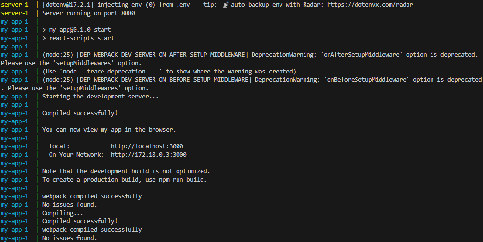
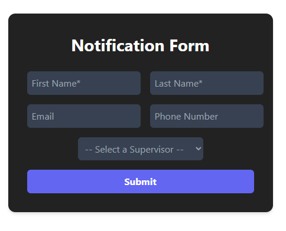

# LightFeather-Coding-Challenge
This project contains a React Typescript frontend and an Express backend. Both are containerized using Docker and can be run together using Docker Compose.

## Prerequisites

- [Docker Desktop](https://www.docker.com/products/docker-desktop) installed and running
- [Node.js](https://nodejs.org/) (optional, for local development)

## Project Structure

```
LightFeather-Coding-Challenge/
├── docker-compose.yml
├── server/
│   ├── Dockerfile
│   └── ... (Express backend files)
├── my-app/
│   ├── Dockerfile
│   └── ... (React frontend files)
```

## Build and Run with Docker Compose
1. **Open Command Prompt (Windows) or Terminal (Mac/Linux):**
   - **Windows**: Press `Windows key + R`, type `cmd`, press Enter
   - **Mac**: Press `Cmd + Space`, type `terminal`, press Enter  
   - **Linux**: Press `Ctrl + Alt + T`

2. **Clone the repository and navigate into project:**
   ```sh
   git clone https://github.com/dsuaib816/LightFeather-Coding-Challenge.git
   cd LightFeather-Coding-Challenge
   ```
3. **Build and start the containers:**
- Make sure Docker Desktop is running and you're authenticated before you start.
   ```sh
   docker-compose up --build
   ```

   This will:
   - Build the backend (Node/Express) and frontend (React) containers
   - Start both containers

   Below is how a successful console log may look:
   

4. **Access the application:**
   - Open your browser and go to: [http://localhost:3000](http://localhost:3000)
   - You should see the application with a form similar to this:

   

## Stopping the Application

Press `Ctrl+C` in your terminal, then run:
```sh
docker-compose down
```

## Local Development (Optional)

You can run the backend and frontend separately for development:

1. **Backend:**
   ```sh
   cd server
   npm install
   npm start
   ```

2. **Frontend:**
   ```sh
   cd my-app
   npm install
   npm start
   ```

Access the frontend at [http://localhost:3000](http://localhost:3000).

## Notes

- The backend runs on port `8080` inside the container
- The frontend runs on port `3000` inside the container

## Technologies Used

- **Frontend:** React, TypeScript, Tailwind CSS
- **Backend:** Node.js, Express.js
- **Containerization:** Docker, Docker Compose
- **Validation:** Yup (client-side), Custom validators (server-side)

---

Thank you for taking the time to view my application!

